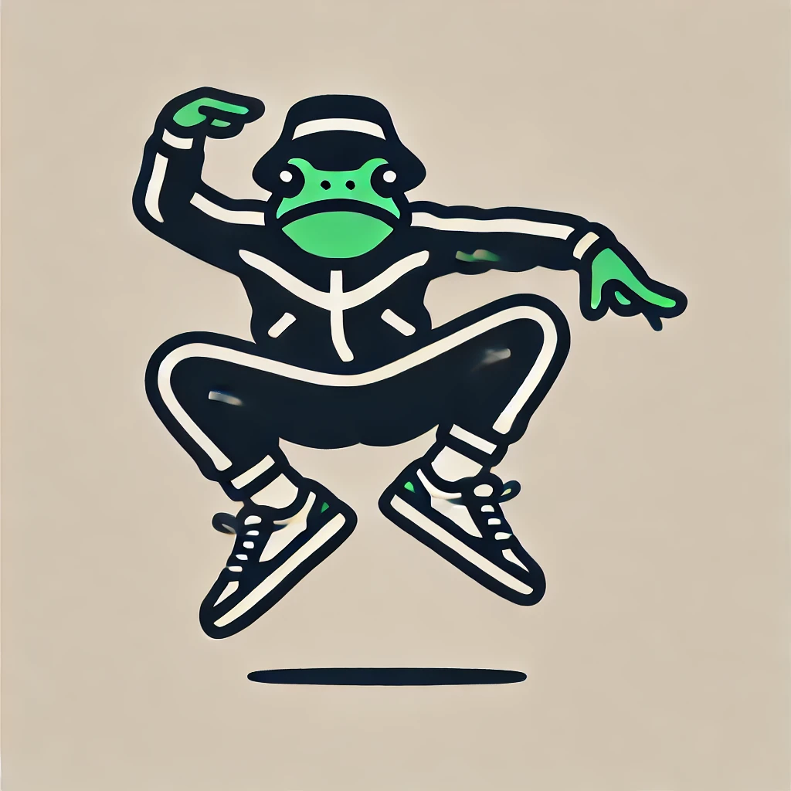
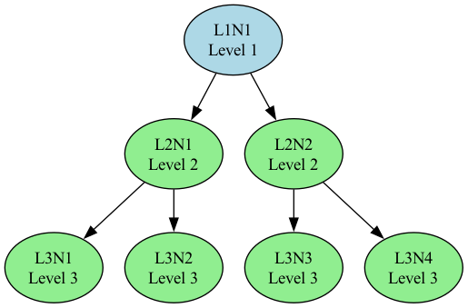
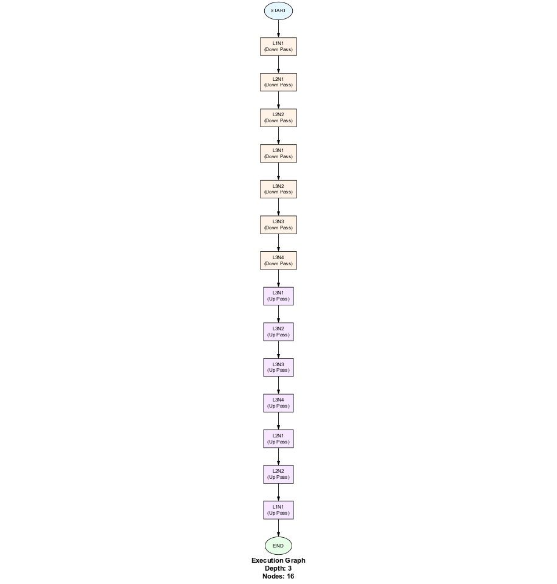
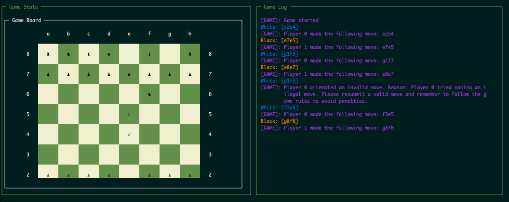

# **strange-mca**: MCA with a strange loop



This multiagent system is a simplified model of a Multiscale Competency Architecture (MCA). Since reading about MCAs in [one](https://pubmed.ncbi.nlm.nih.gov/37156924/) of Michael Levin's recent papers, I see MCAs everywhere :).  Levin poses them as a framework to conceptualize how biological systems exhibit competence (i.e. problem solving skills) across multiple scales - from cells to tissues to organs to organisms to social groups. I've been looking for a way to model the concept in software, and using LLMs as information processing nodes in an MCA seemed like a fun experiment. 

This system is also inspired by Hofstadter's [Strange Loop](https://en.wikipedia.org/wiki/Strange_loop). There is a bit of (configurable) self-reflection when giving a response to a prompt at the root node in this system. Perhaps this is similar to what today's reasoning models do (albeit in more sophisticated form)

For both MCA and Strange Loop concepts, this system is a minimal (but fun) attempt at running a multiagent system that models these concepts. In the *Future Ideas and Improvements* section near the end, I share some thoughts for iteration on the system.

I thought it would make for interesting behavior and comparisons to point this at an OpenAI GYM style environment like TextArena to see it play chess and other games against other LLMs. So I have included TextArena integration code in the `examples` section.

Probably the most fun thing to do with it right now, besides asking ambigious or absurd questions is to have it play a game of chess against a single LLM of the same spec. They play about as well as you'd expect a LLM to play chess, but it is interesting to see agents decompose a problem into lower levels, synthesize them upwards, and then see the strange loop do its thing on the final response. In the `assets` directory there is an example output `final_state.json` that shows the first turn `state` object for the strange-mca set at 2 child-per-node, 3 levels, and gpt-4o-mini. All the messy chatter in its full glory to look through if it sounds interesting. This json is produced in the output dir for every execution of strange-mca. The json file is the main way to inspect how the agents behaved. You can also play with cmd line args to get more info in stdout.

## High Level Architecture

The `AgentTree` class in agents.py represents the conceptual MCA structure of the system. This uses a networkx directed graph as the core conceptual structure.

Separately, the `exectution_graph` in graph.py represents the execution graph for processing to propogate through the system. This uses LangGraph. 

Below are an image of the AgentTree on the left and the LangGraph execution graph on the right.

<div style="display: flex; justify-content: space-between;">
  
  
</div>

Tasks are decomposed down the AgentTree and responses are synthesized upwards. The execution graph on the right represents the flattened bfs downward and upward traversal of the tree on the left. The graphs were kept separate to allow for full control of execution traversal and to simplify debugging. If scale, concurrency, and/or dynamic routing are desired in the future, it will make sense to move over to LangGraph entirely.

## Future Ideas and Improvements

This system mainly serves as a playground to model MCA and StrangeLoop in a functional way. This will be the focus, not so much things like scale and performance. It may even solve puzzles better than its non-MCA competitors one day. The current level of chess competition is mostly about tied on who can send an invalid response last. Future more powerful agents will make this more interesting competition.

### MCA 
* This version is very top down. Perhaps this is antithetical to an MCA, where each layer provides the potential for a new level of problem-solving/magic to emerge above it.
* Basal cognition will be an interesting concept to play around with. In social groups, I think of culture as the basal cognition layer. Giving these agents cultural system prompts might be interesting.
* Task-decomposition and response-synthesis functions result in weak multiscale layers at the agent levels but it could be made strong.
* Agents could be set to different capabilities (ie LLM spec) at different levels.
* Agents could be have a chat memory to help the system "learn" from good/bad moves.
* This version is very static/rigid. Seems like dynamic routing and perhaps even structure will make sense.


### Strange Loop Ideas
* This is in a very basic form. I'll have to re-read Hofstadter's book to grasp it better but I believe part of the magic comes in hierarchical layers of the loop itself. Not sure what that means exactly, but it currently is only done at the top level.
* It sometimes entirely replaces the response with its own view.
* The domain_specific_instructions were an interesting tweak to get the games to run reliably but not sure it belongs in a strange loop logic.

### Tech improvements
* I will try to modify this to use local LLMS (MLX on my mac). An MCA system of agents running locally just feels right.
* Should probably consolidate in to one graph, likely LangGraph in the future.


## Features

- **Hierarchical Agent Structure**: Configurable tree of agents with customizable depth and branching factor
- **Bidirectional Processing**: Top-down task decomposition and bottom-up response synthesis
- **Strange Loop Refinement**: Optional refinement of the final response through self-critique
- **Visualization Tools**: Generate visual representations of the agent tree and execution graph
- **TextArena Integration**: Run strange-mca agents in game environments using TextArena

## Installation

### Prerequisites

- Python 3.8+
- [Poetry](https://python-poetry.org/) for dependency management

### Setup

1. Clone the repository:
   ```bash
   git clone https://github.com/yourusername/strange-mca.git
   cd strange-mca
   ```

2. Install dependencies using Poetry:
   ```bash
   poetry install
   ```

3. Create a `.env` file in the project root with your OpenAI API key:
   ```
   OPENAI_API_KEY=your_api_key_here
   ```

## Usage

### Running the Multi-Agent System

You can run the strange-mca system using the command-line interface:

```bash
poetry run python -m src.strange_mca.main --task "Your task here" --child_per_parent 3 --depth 2 --model "gpt-3.5-turbo"
```

#### Command-line Options

- `--task`: The task to perform
- `--child_per_parent`: Number of children per parent node (default: 3)
- `--depth`: Number of levels in the tree (default: 2)
- `--model`: LLM model to use (default: "gpt-3.5-turbo")
- `--log_level`: Logging level (debug, info, warning, error, critical)
- `--all_logs`: Show logs from dependencies in addition to local logs
- `--viz`: Generate visualizations of the agent tree and execution graph
- `--dry_run`: Don't run the system, just show the configuration
- `--print_tree`: Print the agent tree structure
- `--print_details`: Print details about each agent
- `--domain_specific_instructions`: Domain-specific instructions for the strange loop prompt
- `--strange_loop_count`: Number of strange loop iterations to perform

### Programmatic Usage

You can also use strange-mca programmatically in your Python code:

```python
from src.strange_mca.run_strange_mca import run_strange_mca

result = run_strange_mca(
    task="Explain the concept of multi-agent systems",
    child_per_parent=2,
    depth=2,
    model="gpt-3.5-turbo",
    viz=True,
    domain_specific_instructions="Focus on practical applications",
    strange_loop_count=1
)

print(result["final_response"])
```

### TextArena Integration



*Figure: strange-mca vs. single LLM agent playing chess*


strange-mca can be used with [TextArena](https://github.com/LeonGuertler/TextArena) to create agents that play games and solve interactive tasks. The integration is available in the `examples/arena` directory.

#### Running a TextArena Game

```bash
poetry run python examples/arena/strange_basic_twoplayer.py
```

This will run a two-player game (SpellingBee by default) with a strange-mca agent competing against an OpenAI agent.

#### Available Game Scripts

- `strange_basic_twoplayer.py`: Runs a basic two-player game without rendering
- `strange_rendered_twoplayer.py`: Runs a two-player game with visual rendering

#### Creating Custom Game Scripts

You can create custom game scripts by following the template in the existing scripts. The key components are:

1. Initialize the strange-mca agent with appropriate parameters
2. Set up the game environment using TextArena
3. Create a game loop to manage turns and actions

Example:

```python
import textarena as ta
from strangemca_textarena import StrangeMCAAgent

# Initialize agents
agents = {
    0: StrangeMCAAgent(
        child_per_parent=2,
        depth=2,
        model="gpt-4o-mini",
        domain_specific_instructions="Your game-specific instructions here",
        strange_loop_count=2
    ),
    1: ta.agents.OpenAIAgent(
        model_name="gpt-4o-mini",
        system_prompt="Your system prompt here",
    ),
}

# Initialize environment
env = ta.make(env_id="Chess-v0")
env = ta.wrappers.LLMObservationWrapper(env=env)

# Game loop
env.reset(num_players=len(agents))
done = False
while not done:
    player_id, observation = env.get_observation()
    action = agents[player_id](observation)
    done, info = env.step(action=action)
```

## Project Structure

- `src/strange_mca/`: Core implementation of the strange-mca system
  - `main.py`: Command-line interface and main execution script
  - `run_strange_mca.py`: Programmatic API for running the system
  - `graph.py`: Implementation of the execution graph using LangGraph
  - `agents.py`: Agent definitions and tree structure
  - `prompts.py`: Prompt templates for various stages of processing
  - `visualization.py`: Tools for visualizing the agent tree and execution
  - `logging_utils.py`: Utilities for detailed logging
- `examples/`: Example use cases and integrations
  - `arena/`: TextArena integration
    - `strangemca_textarena.py`: Integration of strange-mca with TextArena
    - `strange_basic_twoplayer.py`: Basic two-player game script
    - `strange_rendered_twoplayer.py`: Two-player game with rendering
- `output/`: Generated outputs and visualizations

## Note on AI assistant use

Cursor with Sonnet 3.7 was used to help write this code.  The core pieces like graph.py, agents.py, prompts.py, and the TextArena integration were carefully inspected, refactored for conciseness, and thoroughly tested for correct behavior. Other, less core, parts of the repo like visualization.py, loggingutils.py, and tests were checked quickly for correctness and run but have a higher slop factor.

## Development

### Adding New Features

1. Fork the repository
2. Create a feature branch: `git checkout -b feature-name`
3. Implement your changes
4. Run tests: `poetry run pytest`
5. Submit a pull request

### Code Style

This project follows PEP 8 guidelines. You can check your code style with:

```bash
poetry run flake8
```

### Linting

This project uses Ruff and Black for code linting and formatting. You can run the linting scripts with:

```bash
# Run both Ruff and Black on the default directories
./scripts/lint.sh

# Fix issues automatically
./scripts/lint.sh --fix
```

See `scripts/README.md` for more details on the linting scripts.

## License

This project is licensed under the MIT License - see the LICENSE file for details.

## Acknowledgments

- This project uses [LangGraph](https://github.com/langchain-ai/langgraph) for graph-based execution
- TextArena integration is based on [TextArena](https://github.com/LeonGuertler/TextArena) 